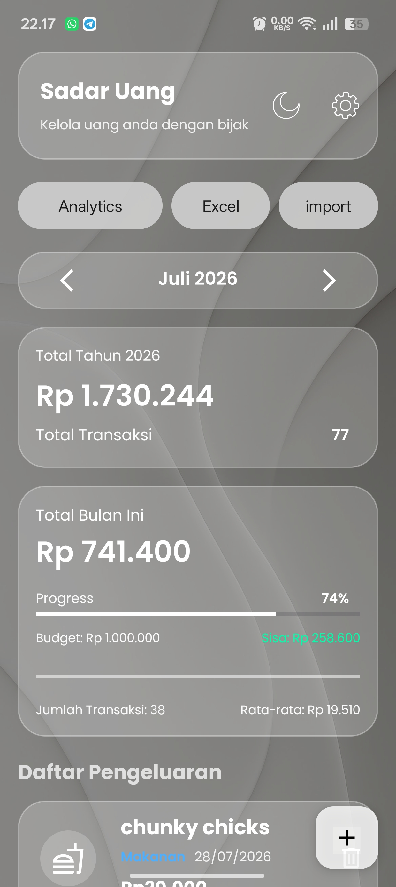
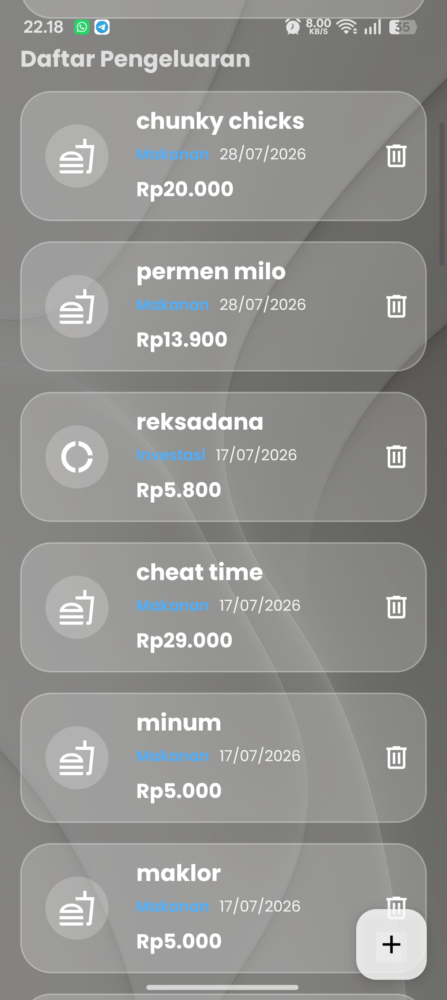
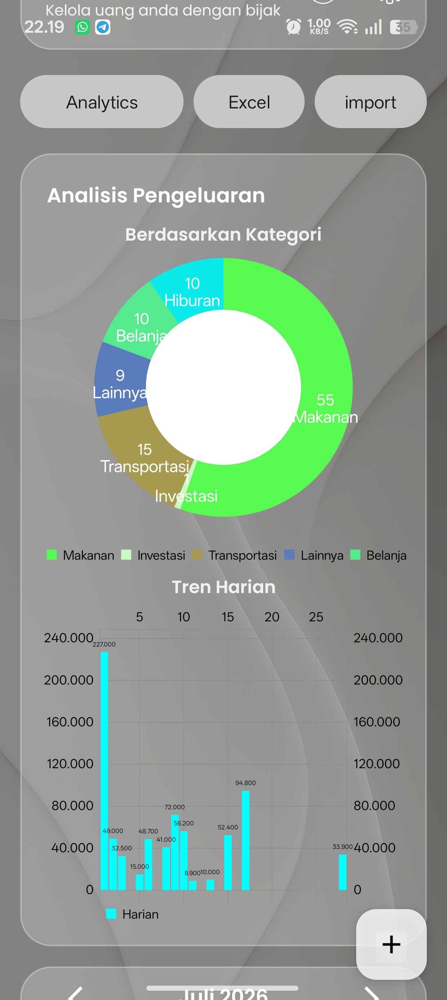
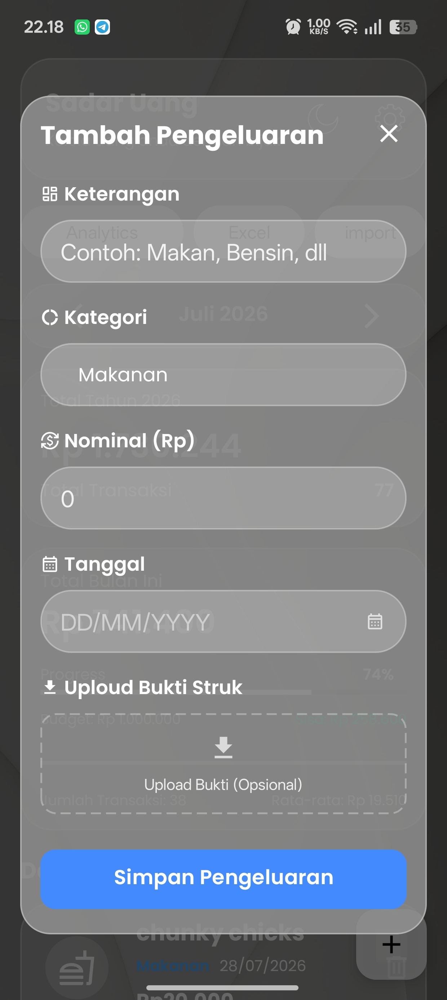
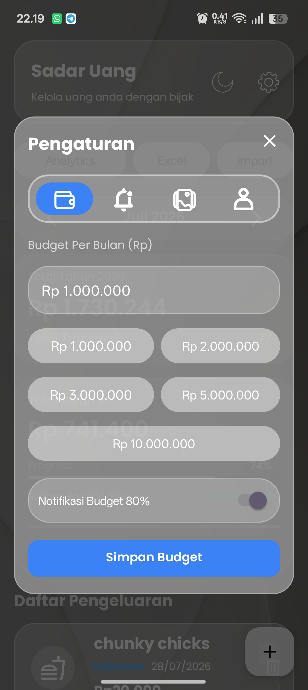
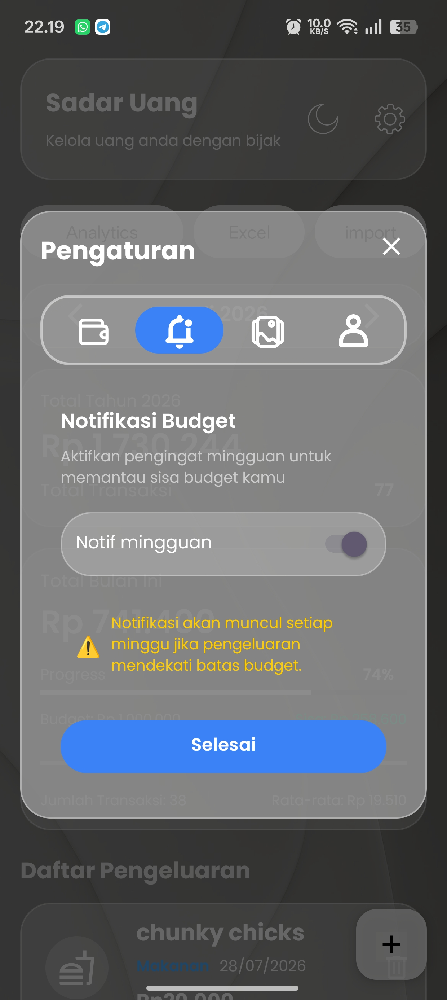
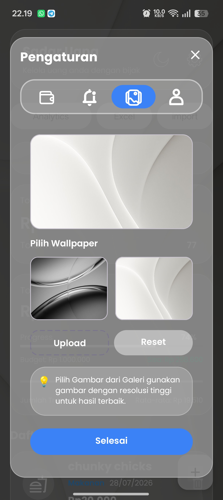
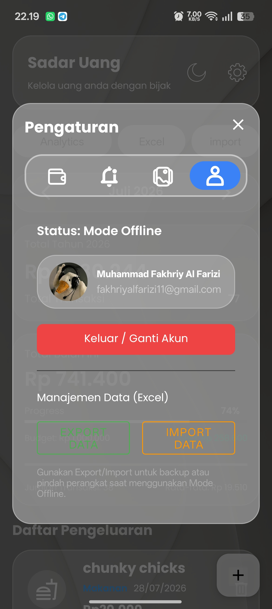
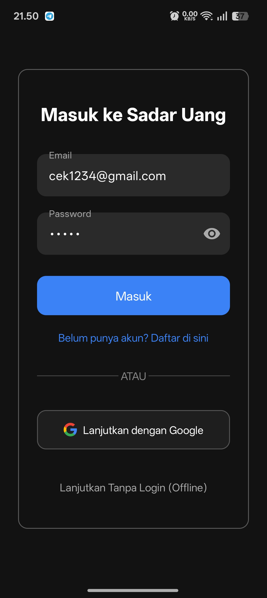
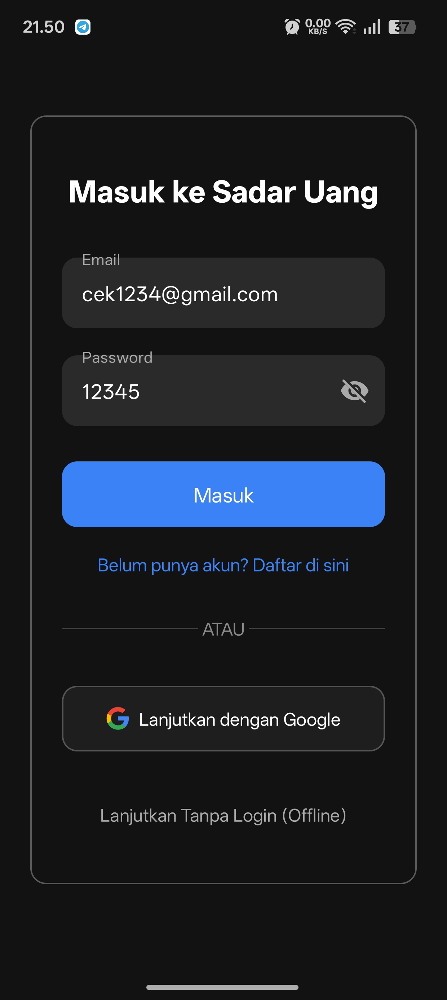

#  Sadar Uang

> **Personal Finance Management Android Application**

**Sadar Uang** adalah aplikasi Android untuk membantu pengguna **mencatat, mengelola, dan menganalisis pengeluaran pribadi** dalam satu tempat.

Aplikasi ini membantu pengguna memantau pengeluaran harian, mengatur budget bulanan, melihat pola pengeluaran berdasarkan kategori, serta melakukan backup data melalui fitur **Excel Export/Import**.

---

##  Preview

<p align="center">
  
  
  
  
</p>

---

##  Project Overview

Mengelola keuangan pribadi sering kali menjadi sulit ketika transaksi dicatat secara manual atau tersebar di berbagai aplikasi.

**Sadar Uang** dibuat sebagai solusi sederhana untuk membantu pengguna:

* Mencatat transaksi pengeluaran secara terstruktur
* Mengetahui total pengeluaran bulanan dan tahunan
* Menetapkan budget bulanan
* Memantau persentase penggunaan budget
* Melihat pengeluaran berdasarkan kategori
* Menganalisis tren pengeluaran
* Menyimpan bukti transaksi
* Melakukan backup dan pemindahan data melalui Excel

Dengan demikian, pengguna dapat memperoleh gambaran yang lebih jelas mengenai kebiasaan pengeluaran mereka.

---

##  Features

###  Authentication

* Login menggunakan email dan password
* Login menggunakan Google
* Registrasi akun
* Mode Offline tanpa login
* Password visibility toggle

###  Expense Management

* Menambahkan transaksi pengeluaran
* Keterangan transaksi
* Kategori pengeluaran
* Nominal transaksi
* Tanggal transaksi
* Upload bukti struk
* Daftar riwayat pengeluaran
* Menghapus transaksi

###  Financial Dashboard

Dashboard menampilkan ringkasan kondisi keuangan pengguna secara langsung, termasuk:

* Total pengeluaran tahun berjalan
* Total pengeluaran bulan berjalan
* Jumlah transaksi
* Rata-rata pengeluaran
* Persentase penggunaan budget
* Sisa budget

###  Budget Management

Pengguna dapat menentukan budget bulanan dan memantau penggunaannya.

Fitur budget meliputi:

* Custom budget bulanan
* Preset budget

  * Rp1.000.000
  * Rp2.000.000
  * Rp3.000.000
  * Rp5.000.000
  * Rp10.000.000
* Progress penggunaan budget
* Sisa budget
* Notifikasi ketika penggunaan budget mencapai 80%

###  Expense Analytics

Aplikasi menyediakan visualisasi pengeluaran untuk membantu pengguna memahami pola keuangan.

Analytics meliputi:

* Distribusi pengeluaran berdasarkan kategori
* Grafik tren pengeluaran harian
* Perbandingan kategori pengeluaran

###  Calendar-Based Management

* Navigasi berdasarkan bulan
* Pengelolaan transaksi berdasarkan tanggal
* Ringkasan pengeluaran per periode

###  Data Management

* Excel Export
* Excel Import
* Backup data
* Pemindahan data antar perangkat
* Mode Offline

###  Receipt Management

Pengguna dapat menambahkan foto bukti transaksi pada saat mencatat pengeluaran.

###  Personalization

* Light Mode
* Dark Mode
* Custom wallpaper
* Reset wallpaper
* Pengaturan aplikasi

---

##  Tech Stack

| Technology          | Usage                                  |
| ------------------- | -------------------------------------- |
| **Kotlin**          | Main programming language              |
| **Jetpack Compose** | Building the user interface            |
| **Android Studio**  | Development environment                |
| **Room Database**   | Local data persistence                 |
| **Material Design** | UI components and design system        |
| **Gradle**          | Build system and dependency management |

---

##  Application Architecture

Sadar Uang menggunakan struktur Android yang memisahkan tampilan, pengelolaan data, dan logic aplikasi.

```text
┌─────────────────────────────┐
│        Presentation UI      │
│       Jetpack Compose       │
└──────────────┬──────────────┘
               │
               ▼
┌─────────────────────────────┐
│      Application Logic      │
│   State & Business Logic    │
└──────────────┬──────────────┘
               │
               ▼
┌─────────────────────────────┐
│        Data Layer           │
│        Room Database        │
└──────────────┬──────────────┘
               │
               ▼
┌─────────────────────────────┐
│       Local Storage         │
│    Expense / Budget Data    │
└─────────────────────────────┘
```

Struktur ini membantu memisahkan tanggung jawab masing-masing bagian sehingga aplikasi lebih mudah dikembangkan dan dipelihara.

---

##  Project Structure

```text
sadar-uang/
│
├── app/
│   ├── src/
│   │   └── main/
│   │       ├── java/
│   │       │   └── ...
│   │       │
│   │       ├── res/
│   │       │   ├── drawable/
│   │       │   ├── mipmap/
│   │       │   └── values/
│   │       │
│   │       └── AndroidManifest.xml
│   │
│   ├── build.gradle.kts
│   └── proguard-rules.pro
│
├── assets/
│   └── screenshots/
│       ├── dashboard.jpg
│       ├── expense-list.jpg
│       ├── add-expense.jpg
│       ├── analytics.jpg
│       ├── budget.jpg
│       ├── notification.jpg
│       ├── wallpaper.jpg
│       ├── account.jpg
│       ├── login-hidden.jpg
│       └── login-visible.jpg
│
├── gradle/
│
├── build.gradle.kts
├── gradle.properties
├── settings.gradle.kts
└── README.md
```

---

#  Screenshots

##  Dashboard

Dashboard memberikan ringkasan kondisi keuangan pengguna dalam satu tampilan.

Informasi yang ditampilkan meliputi total pengeluaran tahunan, total pengeluaran bulan berjalan, jumlah transaksi, rata-rata pengeluaran, progress budget, dan sisa budget.

<p align="center">
  
</p>

---

## Expense History

Halaman daftar pengeluaran menampilkan seluruh transaksi yang telah dicatat pengguna.

Setiap transaksi menampilkan:

* Nama transaksi
* Kategori
* Tanggal
* Nominal
* Tombol hapus

<p align="center">
  
</p>

---

##  Add Expense

Pengguna dapat menambahkan transaksi baru dengan memasukkan:

* Keterangan
* Kategori
* Nominal
* Tanggal
* Bukti struk

<p align="center">
  
</p>

---

##  Expense Analytics

Halaman analytics membantu pengguna memahami pola pengeluaran melalui visualisasi data.

Tersedia:

* Donut chart berdasarkan kategori
* Grafik tren pengeluaran harian

<p align="center">
  
</p>

---

##  Budget Management

Pengguna dapat menentukan budget bulanan dan melihat perkembangan penggunaan budget.

<p align="center">
  
</p>

---

##  Budget Notification

Aplikasi menyediakan pengingat ketika penggunaan pengeluaran mendekati batas budget.

<p align="center">
  
</p>

---

##  Wallpaper Customization

Pengguna dapat memilih wallpaper bawaan aplikasi, mengunggah wallpaper sendiri, atau mengembalikan wallpaper ke pengaturan awal.

<p align="center">
  
</p>

---

##  Account & Data Management

Halaman akun menyediakan informasi akun serta fitur manajemen data.

Pengguna dapat:

* Melihat status akun
* Keluar atau mengganti akun
* Export data
* Import data
* Menggunakan aplikasi dalam mode Offline

<p align="center">
  
</p>

---

##  Login

Sadar Uang menyediakan autentikasi menggunakan email dan password serta opsi login menggunakan Google.

<p align="center">
  
  
</p>

---

#  My Contribution

Dalam pengembangan Sadar Uang, saya berkontribusi pada proses perancangan dan pengembangan aplikasi Android, meliputi:

###  UI/UX Development

* Merancang tampilan aplikasi menggunakan pendekatan modern dan minimalis
* Mengimplementasikan interface menggunakan Jetpack Compose
* Membuat komponen UI seperti card, button, dialog, navigation, dan form
* Mengimplementasikan Light Mode dan Dark Mode
* Membuat sistem custom wallpaper

###  Android Development

* Mengembangkan fitur pencatatan transaksi
* Mengembangkan sistem budget bulanan
* Mengembangkan dashboard keuangan
* Mengimplementasikan expense history
* Mengembangkan halaman analytics
* Mengimplementasikan upload bukti transaksi

###  Data Management

* Mengimplementasikan Room Database
* Mengelola penyimpanan data transaksi secara lokal
* Mengembangkan fitur Excel Export
* Mengembangkan fitur Excel Import
* Menyediakan mekanisme backup dan pemindahan data

###  Financial Analytics

* Mengolah data pengeluaran
* Mengelompokkan transaksi berdasarkan kategori
* Menghitung total pengeluaran
* Menghitung rata-rata pengeluaran
* Menghitung progress penggunaan budget
* Menampilkan data dalam bentuk grafik

###  Authentication

* Mengimplementasikan login menggunakan email dan password
* Menyediakan Google Sign-In
* Menyediakan mode Offline

---

#  Key Technical Challenges

Beberapa bagian yang menjadi tantangan dalam pengembangan aplikasi:

### 1. Expense & Budget Calculation

Aplikasi harus menghitung pengeluaran berdasarkan periode tertentu dan menghubungkannya dengan budget bulanan.

Contoh:

```text
Budget       = Rp1.000.000
Pengeluaran  = Rp741.400

Progress     = 74%
Sisa Budget  = Rp258.600
```

### 2. Expense Analytics

Data transaksi perlu dikelompokkan berdasarkan kategori sebelum dapat divisualisasikan dalam bentuk grafik.

```text
Makanan      → 55
Transportasi → 15
Lainnya      → 9
Belanja      → 10
Hiburan      → 10
Investasi    → ...
```

### 3. Offline Data Management

Aplikasi tetap dapat digunakan tanpa koneksi internet melalui penyimpanan data lokal.

Room Database digunakan untuk menyimpan data sehingga pengguna tetap dapat mencatat dan melihat transaksi ketika berada dalam mode Offline.

### 4. Data Backup & Migration

Fitur Export/Import dikembangkan untuk membantu pengguna melakukan backup dan memindahkan data ketika berpindah perangkat.

---

# 🚀 How to Run

### Requirements

* Android Studio
* JDK yang sesuai dengan konfigurasi project
* Android SDK
* Android device atau Android Emulator

### Installation

1. Clone repository:

```bash
git clone https://github.com/USERNAME/sadar-uang.git
```

2. Buka project menggunakan Android Studio.

3. Tunggu proses Gradle Sync selesai.

4. Hubungkan Android device atau jalankan Android Emulator.

5. Jalankan aplikasi menggunakan:

```text
Run ▶
```

---

#  Project Status

**Status:** Completed / Portfolio Project

Sadar Uang dikembangkan sebagai project Android untuk menerapkan kemampuan dalam:

* Android Development
* Kotlin
* Jetpack Compose
* Local Database
* UI/UX Design
* Data Visualization
* Financial Data Management

---

#  Future Improvements

Beberapa pengembangan yang dapat dilakukan selanjutnya:

* Cloud synchronization
* Automatic cloud backup
* Recurring transactions
* Financial goals
* Monthly financial reports
* PDF report generation
* More advanced financial analytics
* Multi-device synchronization
* Improved notification scheduling

---

#  Developer

**Muhammad Fakhriy Al Farizi**

Mahasiswa Sistem Informasi — Universitas Gunadarma

Interested in:

* Android Development
* Software Development
* Data Analysis
* UI/UX Design

---

##  Why Sadar Uang?

Sadar Uang bukan hanya aplikasi pencatat pengeluaran, tetapi merupakan project yang menggabungkan:

**UI/UX + Android Development + Local Database + Data Processing + Data Visualization**

Project ini dibuat untuk menunjukkan kemampuan dalam membangun aplikasi Android dari sisi **interface, functionality, data management, hingga financial analytics**.
